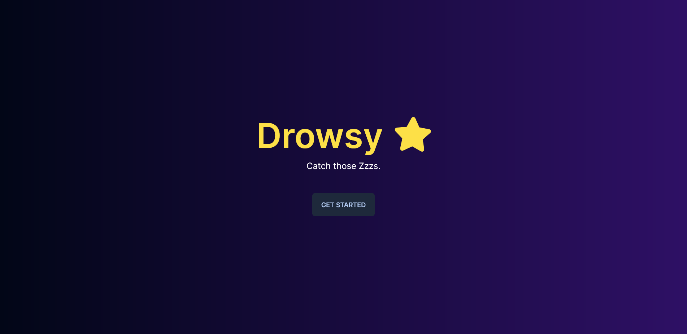
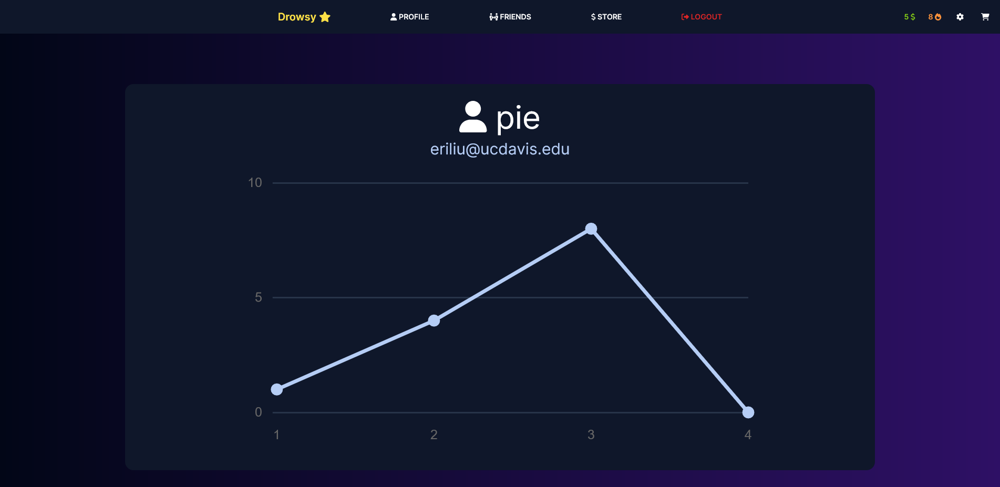
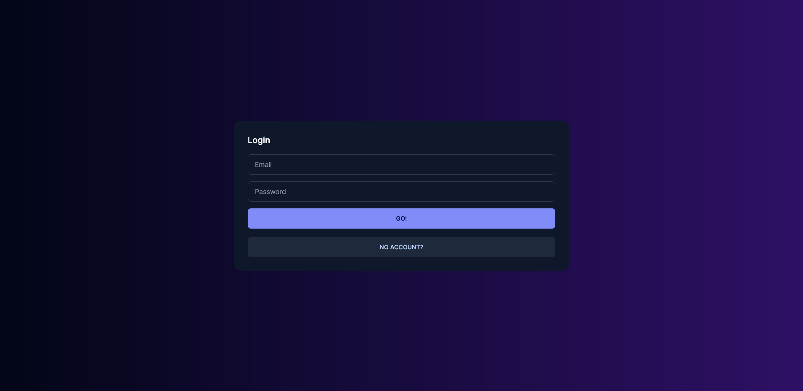

# Drowsy ⭐

[Catch those Zzzs.](https://thatliuser.github.io/hackdavis.2023/)

Drowsy is a project aimed towards sleep-derived college students (like the authors!),
encouraging them to start and maintain healthy sleep schedules by incentivizing
behavior through a fun reward system and detailed statistics about your sleep.

## Planned Features 🌙
- Streaks: Drowsy rewards users with streaks, similar to other popular applications like Duolingo and Snapchat, to keep users on track.
- Tracking: Drowsy integrates with various sleep tracking devices to help users gain insight into their daily sleep patterns.
- Goal setting: Users can set sleep goals to ensure they get the well-deserved rest they need.
- Notifications: Drowsy's mobile app can help the user remember to get into bed by their target time.

Drowsy aims to improve the lives of many a sleep-deprived student, helping them maintain healthier lifestyles through
comprehensive analysis, tracking, and streak setting!

## Tech stack 💻
- [Next.js](https://nextjs.org/)
- [Appwrite](https://appwrite.io/)
- [GitHub pages](https://pages.github.com/)

## Visuals 🔥

